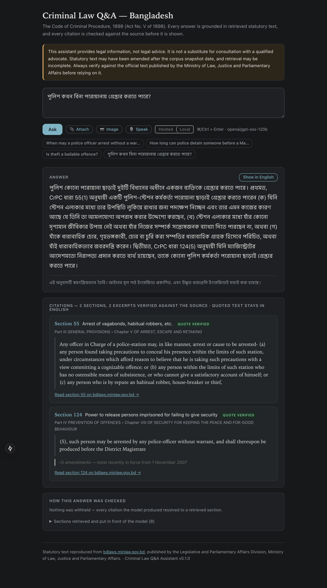

## What it does

A question-answering assistant for Bangladesh criminal law, built on the Code of Criminal Procedure, 1898 (Act No. V of 1898) with its amendments and its Schedule II, and the Penal Code, 1860.

- Every answer is grounded in retrieved statutory text and cites the sections it rests on.
- Every quoted excerpt is checked against the source before it is shown.
- Where the corpus does not support a confident answer, it says so instead of producing one.
- A question can be typed, spoken in English or Bangla, photographed, or asked about an attached document. A document is read as context and never treated as law.

> Legal information, not legal advice. It is not a substitute for a qualified advocate, and the statute may have been amended after the corpus was taken.

## The demo

The recording above asks three questions, each chosen to show something different:

1. Arrest without a warrant, answered from section 54 with the amendment that produced its current wording.
2. Whether theft is bailable, answered from the offence's Schedule II row rather than by retrieval.
3. A question outside the corpus, where declining is the feature.

It uses the hosted model, `openai/gpt-oss-120b` on Groq, which answers in seconds. The live demo runs on free tiers: about 60 questions a day before it says so and recovers, and 21 seconds to wake from a cold start.

## The same questions on a local model

Here are the same three questions on `qwen2.5:3b-instruct`, running locally through Ollama: free and unmetered, materially weaker, so its answers are plainer and take visibly longer. What stays identical is everything that matters: the same retrieval, the same citation checks, and the same amendment history on every citation.

<figure>
  <video controls playsinline preload="metadata" src="/uploads/criminal-law-qa-demo-local.webm"></video>
  <figcaption>The local model, answering the same three questions.</figcaption>
</figure>

## How an answer is made

Two pipelines meet at the index.

- **Ingestion** parses the statutes into sections, amendment records and Schedule II offence rows.
- **A question** arrives as text, speech, an image or a document, and every form becomes text at the boundary, so one evaluation covers every way of asking.
- The question is answered by retrieval and generation, and the answer then passes through a deterministic citation gate that can refuse it.

## Decisions that shape the answers

**Offence classification is looked up, not retrieved.** "Is theft a bailable offence?" embeds closest to the sections about bail, 496 and 497, while the row that decides it, Penal Code section 379 in Schedule II, ranks nowhere. Retrieval would give a fluent, correctly cited, wrong answer. So a question naming an offence gets that offence's Schedule II row put in front of the model directly.

**A table's answer is a column.** Asked about bail, the small model once quoted the cognizability line from the row: verbatim, verified, and not the answer. The row's columns are parsed, so the whole row is now shown, with the checked excerpt beside it.

**The section is the unit of citation.** Chunks never cross a section boundary, because a citation that cannot name a section cannot be checked.

**Only operative law is retrievable as law.** An amending act's text is a diff, not a provision. Indexed alongside the Code, it would let a question about what a section provides retrieve an ordinance's instruction to delete a word. Each document's role is read from its own title, and amending acts are kept out of the index at ingestion.

**Current wording is not the whole answer.** Every citation carries the amendments that produced it: what changed, under which act, and from what date. Section 54 was substituted by Act XI of 2026 with effect from 10 August 2025, and its wording does not say so. Whether a section governs a matter can depend on when the matter arose.

## Bangla questions, statute in English

Bangla questions are answered from the English statute, and an answer can be translated into Bangla on demand. The quoted excerpts stay in English, because a translated "verbatim" quotation is no longer verbatim.

## Measured, stage by stage

Four stages, each adding one thing to the stage before, are run on the same 101 questions with one scorer and deterministic metrics only. The questions cover direct lookups, multi-section and amended provisions, unanswerable and ambiguous questions, and Bangla. Every gold label was verified against the fetched statute, never recalled.

On the local model, with all 101 questions measured at every stage:

| Stage | Retrieval recall | Citation precision | Answer hit rate | Quotations verified | Refusal accuracy |
|---|---|---|---|---|---|
| 1. Model only, no retrieval | n/a | 6.9% | 1.3% | 0.0% | 73.3% |
| 2. Fixed-size chunks | 63.6% | 61.2% | 48.0% | 52.9% | 90.1% |
| 3. Chunks on section boundaries | 80.5% | 66.3% | 63.6% | 83.9% | 88.1% |
| 4. Full corpus, with offence lookup | 81.8% | 59.1% | 61.0% | 87.5% | 90.1% |

With nothing retrieved, the model quoted law from memory: 143 quotations, all fabricated. That control is what makes the citation check mean something.

A quotation can fail in two ways, with opposite fixes:

| Stage | Verified | Real text, wrong section | In no section at all |
|---|---|---|---|
| 1. Model only | 0.0% | 0.0% | 100.0% |
| 2. Fixed-size chunks | 52.9% | 18.6% | 28.6% |
| 3. Section boundaries | 83.9% | 5.4% | 10.8% |
| 4. Full corpus | 87.5% | 6.2% | 6.2% |

Chunking on section boundaries cut misattribution from 18.6% to 5.4%. Retrieval cut fabrication at every stage.

Stage 4 is a trade, not an improvement. Citation precision falls, because about a thousand more chunks compete for the same eight retrieval slots. In return, offence questions can be answered at all, with the lowest fabrication and the best refusal accuracy of any stage.

The hosted model retrieves exactly what the local one does at stages 3 and 4, and does more with it: 79.3% citation precision against 66.3% at stage 3, an 83.1% answer hit rate against 61.0% at stage 4, and no misattributed quotations. As shipped, it declines 15 of 15 unsupported questions.

## Keeping the law current

The index converges on whatever sources are present, so adding, replacing and removing an act are the same operation. Chunks are matched on a stable id and compared on a hash of their text, so only new or changed ones are embedded.

| Operation | Embedded | Reused | Time |
|---|---|---|---|
| Full build, the Code only | 621 of 621 | — | 20.5 s |
| Add Schedule II (376 rows) | 376 of 997 | 62% | 14.9 s |
| Amend one section | 1 of 997 | 99.9% | 0.1 s |

The Penal Code joined the same way: 601 chunks from its 555 sections, taking the corpus from 997 to 1,598 chunks while the existing ones kept their vectors.

## Limitations

- **Ambiguous questions.** Asked something like "Can I get bail?", the hosted model now asks what was meant on 6 of 9 such questions. The local model does not get that rule, and declines 1 of 9. The rule also pushes some yes-or-no answers towards "No": one Bangla question about bail is now answered wrongly.
- **A refusal's reason is not checked.** Citations and quotations are verified against the statute; the model's explanation of why it declined is not.
- **No text as it stood on a past date.** It reports when a provision changed, but does not reconstruct the earlier wording, because bdlaws publishes only the current consolidation.
- **An English corpus.** Bangla questions are answered from English statutory text; the Bangla texts are not yet ingested.
- **The prose around a quotation is not measured.** The checks prove a quotation is the section's own words, not that the sentences around it describe the section correctly.
- **Statute only.** Case law is out of scope, and the corpus is only as current as bdlaws.

## Built with

FastAPI on Python 3.12 and a Next.js interface, served from one process. Exact in-process NumPy vector search over `paraphrase-multilingual-MiniLM-L12-v2` embeddings on ONNX. Groq's `openai/gpt-oss-120b`, with `qwen2.5:3b-instruct` on Ollama as the local fallback; `whisper-large-v3` for speech and tesseract for images, in English and Bengali.

The repository holds twelve architecture decision records, the experiment log, and a record of how AI tools were used, reviewed and overruled. Statutory text is reproduced from [bdlaws.minlaw.gov.bd](https://bdlaws.minlaw.gov.bd), published by the Legislative and Parliamentary Affairs Division, Ministry of Law, Justice and Parliamentary Affairs.
