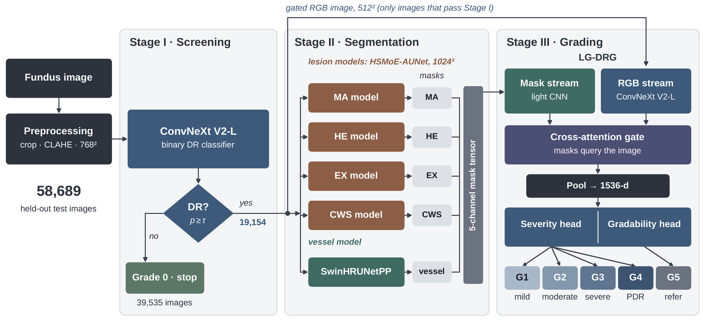

**Under review** at the *IEEE Journal of Biomedical and Health Informatics* (submitted October 2026).
Md Asif Uddin, Niloy Farhan, Rafeed Rahman and Md. Golam Rabiul Alam, Department of Computer Science and Engineering, Brac University.
[Code, trained weights and per-image predictions](https://github.com/asifuddin01/HierarchiRetina) · preprint to follow on TechRxiv or arXiv.

## Why a cascade

Human graders work through diabetic retinopathy in steps:

1. They decide whether any retinopathy is present.
2. They look for the lesions that define the grade.
3. They grade the eye, or refer it when the photograph cannot be read.

Most automated systems compress all of that into one network that maps a photograph to a grade.

Staged systems exist, but they are usually scored stage by stage, on the images each stage happens to receive. A case lost at the first step then never shows up as an error.

HierarchiRetina follows the clinical order and is scored the way a screening programme would experience it: every image enters at the first stage, and every miss counts.

## The three stages

**Stage I, screening gate.** A ConvNeXt V2-L classifier at 768 × 768 pixels separates eyes with no retinopathy (Grade 0) from everything else (Grades 1 to 5, where Grade 5 is an unreadable photograph). Its threshold is fixed on validation data. Images below it stop at Grade 0.

**Stage II, segmentation.**

- HSMoE-AUNet segments four lesion types: microaneurysms, haemorrhages, hard exudates and cotton-wool spots, with one model per lesion type. Its skip, bottleneck and decoder blocks are sparse mixtures of heterogeneous experts. Each lesion gets the expert types, expert counts and losses that suit its size and contrast.
- SwinHRUNetPP, a dual-encoder network, segments the vessels with a loss restricted to the field of view.

**Stage III, LG-DRG grader.** The lesion-guided grader reads the photograph together with the five masks, which query the image through a gated cross-attention path. It has two heads:

- a gradability head, which decides whether the image can be read;
- an ordinal head, which grades severity using thresholds fitted on out-of-fold predictions.

## Where the numbers come from

The end-to-end results come from a held-out test pool of 58,689 images from six public datasets: EyePACS, DDR, IDRiD, APTOS 2019, Messidor-2 and FGADR. The pool was never used for training or for choosing a model or threshold. The DDR result uses all 4,105 images of its official test split, and the Dice scores come from held-out segmentation splits.

## What the end-to-end view showed

**Most errors start at the gate.** The cascade made 10,907 errors end to end:

| Source of error | Share |
|---|---|
| Eyes with retinopathy that the gate stopped | 22.5% |
| Healthy eyes that the gate let through | 43.5% |
| Grading mistakes | 34.0% |

So even a perfect grader would remove only about a third of the errors.

**The grade ignored the masks.** In the mask ablation (fold 0 of the cross-validation), we removed all masks, swapped in another image's masks, and dropped one mask channel at a time. None of these changed the grader's kappa by more than 0.0003. Retraining with the cross-attention gate started open did not change that.

The masks still help a person reviewing the case, but they do not explain the grade. We report this negative result because lesion-aware graders seldom test whether the lesions actually drive the grade.

**The best kappa is not the best screening setting.** A stricter gate (threshold 0.675) raises kappa to 0.825, because fewer healthy eyes reach the grader. But it also blocks 1,320 more eyes with retinopathy, 94% of them mild or moderate. Referral sensitivity then falls from 0.832 to 0.795.

## Limitations

- The evaluation is held-out, not external: the test partitions share sources with the training data.
- EyePACS supplies 91% of the test pool.
- Grade 5 (ungradable) occurs only in DDR.
- Most images were graded once, without adjudication.
- The segmenters were not compared with other architectures on the same splits.

## Reproducibility

The [repository](https://github.com/asifuddin01/HierarchiRetina) holds:

- the code;
- the trained weights (release v1.0);
- per-image predictions;
- a script that recomputes every end-to-end number in the paper (release v1.0.1, 203 checks).

## Background

The project began as my BSc thesis in Computer Science and Engineering at Brac University (2026).
